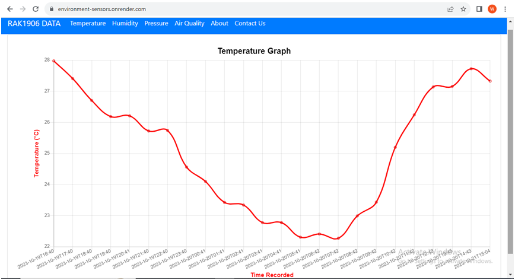

# RAK4630 Environment Sensors Data Logger and Gateway

This project collects environmental data (temperature, humidity, air pressure, and air quality) using the RAK4630 module, sends it to a computer via USB Serial, and processes and stores it using a Java application. The data is then posted to a web application with a REST API for storage and retrieval, and a front-end app for data visualization.

## Components

- **RAK4630 Module**: Collects environmental data from the RAK1906 module.
- **USB Serial**: Transmits the collected data to a computer.
- **Java Application (Gateway)**: Receives the data on the computer, processes it, and posts it to the web application.
- **Web Application**: Provides a REST API to store and retrieve the data.
- **Front-End App**: Displays the collected data in graphs.

## Getting Started

1. **RAK4630 Arduino Script**: Find the Arduino script in the `RAK4630_Data_Logger` folder to program your RAK4630 module.

2. **Java Application (Gateway)**: The Java application that acts as a gateway can be found in the `RAK4630_GATEWAY_APP` folder of this repository. Maven was used to manage the dependencies of the Java project.

3. **Web Application**: Access the web application at [https://environment-sensors.onrender.com/](https://environment-sensors.onrender.com/) for data storage and retrieval.

## Usage

1. Flash the RAK4630 with the provided Arduino script to read data from the RAK1906 module.

2. Connect the RAK4630 to your computer via USB Serial.

3. Run the Java application on your computer to receive, process, and send the data to the web application.

4. Access the web application to view and manage the collected environmental data.

## License

This project is licensed under the [MIT License](LICENSE).

Feel free to fork, contribute, and customize it for your environmental data monitoring needs!

